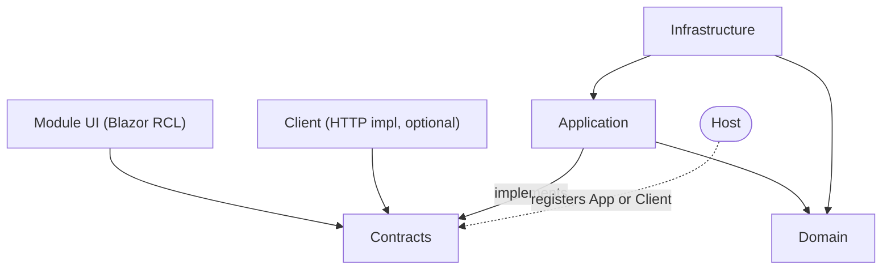

# Glossary

One agreed meaning per domain term. Reference these in every discussion; propose new entries as terms emerge.

## Module

A vertical slice of a system under `src/Modules/<Name>/`, containing its own Clean Architecture layers: [Contracts](#contracts), [Domain](#domain), [Application](#application), [Infrastructure](#infrastructure), optional [Client](#client), and [Module UI](#module-ui). Modules communicate with each other **only** through Contracts.

## Contracts

A [Module](#module)'s pure public surface: interfaces, DTOs, and integration events. The only project other Modules and UIs may reference; it references nothing.

## Domain

A [Module](#module)'s entities, value objects, and domain logic. References nothing.

## Application

A [Module](#module)'s use-case layer and the **in-process** implementation of its [Contracts](#contracts). References Domain and Contracts.

## Infrastructure

Persistence and external-service implementations for a [Module](#module). References Application and Domain.

## Client

An optional **HTTP** implementation of a [Module](#module)'s [Contracts](#contracts), used when the Module is deployed remotely. A [Host](#host) registers it in place of [Application](#application); consumers never know which is running.

## Module UI

A Blazor Razor class library presenting a [Module](#module)'s functionality. Depends only on [Contracts](#contracts), so the same UI runs in any [Host](#host) — web or WPF.

## Host

A composition root — a web app, or a WPF app with BlazorWebView — that assembles [Modules](#module) and registers either [Application](#application) (in-process) or [Client](#client) (HTTP) against each Module's [Contracts](#contracts).

## Vertical Slice

The architectural style of dividing a system by business capability rather than technical layer. Here, each slice is a [Module](#module).

## Plan

An implementation plan document in `docs/plans/`, produced by the writing-plans workflow. Automatically gets an HTML twin via the plan-to-html hook.

## Spec

A validated design document in `docs/superpowers/specs/`, produced by the brainstorming workflow. Also gets an HTML twin automatically.
