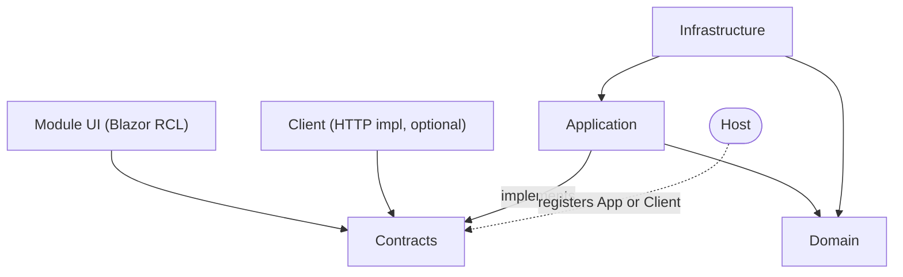

# Glossary

One agreed meaning per domain term. Reference these in every discussion; propose new entries as terms emerge.

## Module

A vertical slice of a system under `src/Modules/<Name>/`, containing its own Clean Architecture layers: [Contracts](#contracts), [Domain](#domain), [Application](#application), [Infrastructure](#infrastructure), optional [Client](#client), and [Module UI](#module-ui). Modules communicate with each other **only** through Contracts.
_Avoid_: feature, component, slice, bounded context

```mermaid
graph TD
  UI["Module UI (Blazor RCL)"] --> C[Contracts]
  Client["Client (HTTP impl, optional)"] --> C
  App[Application] -->|implements| C
  App --> D[Domain]
  Infra[Infrastructure] --> App
  Infra --> D
  Host([Host]) -. registers App or Client .-> C
```

## Contracts

A [Module](#module)'s pure public surface: interfaces, DTOs, and integration events. The only project other Modules and UIs may reference; it references nothing.
_Avoid_: public API, client interface

## Domain

A [Module](#module)'s entities, value objects, and domain logic. References nothing.

## Application

A [Module](#module)'s use-case layer and the **in-process** implementation of its [Contracts](#contracts). References Domain and Contracts.
_Avoid_: services layer, business logic layer

## Infrastructure

Persistence and external-service implementations for a [Module](#module). References Application and Domain.

## Client

An optional **HTTP** implementation of a [Module](#module)'s [Contracts](#contracts), used when the Module is deployed remotely. A [Host](#host) registers it in place of [Application](#application); consumers never know which is running.
_Avoid_: proxy, API wrapper, SDK

## Module UI

A Blazor Razor class library presenting a [Module](#module)'s functionality. Depends only on [Contracts](#contracts), so the same UI runs in any [Host](#host) — web or WPF.
_Avoid_: front-end, component library

## Host

A composition root — a web app, or a WPF app with BlazorWebView — that assembles [Modules](#module) and registers either [Application](#application) (in-process) or [Client](#client) (HTTP) against each Module's [Contracts](#contracts).
_Avoid_: app shell, launcher

## Vertical Slice

The architectural style of dividing a system by business capability rather than technical layer. Here, each slice is a [Module](#module).

## Cogniva

The brand name for this team's shared development tooling. The Claude Code plugin marketplace in this repo is named `cogniva` (hosted at github.com/cogniva/cogniva-skills); general-purpose tools ship in `cogniva-skills` (glossary, reference, project-requirement, project-context), development-specific tools in `cogniva-dev` (adr, backlog, repo-init, add-module, and the feature lifecycle). Tools are never named after individual team members.

## Plan

An implementation plan document in `docs/plans/` or `docs/superpowers/plans/`, produced by the writing-plans workflow.

## Spec

A validated design document in `docs/superpowers/specs/` or `docs/specs/`, produced by the brainstorming workflow.

## Backlog

Planned-deferral work tracked under `docs/plans/`: every new item carries a reason not to do it now in its `because:` tag. A direct human capture that supplies no specific reason is recorded as `because:human later`; skill-initiated deferrals require a concrete reason. Legacy entries without `because:` remain valid and may be flagged by grooming. Loose one-line items in a `BACKLOG.md` (repo-level, or per-[Module](#module)), or feature-sized [Backlog stubs](#backlog-stub). Captured with the `backlog` skill, whose capture bar routes reason-less work to be done now or planned instead; surfaced by `module-status` / `repo-status`.
_Avoid_: todo list, icebox, wishlist

## Backlog stub

A feature-sized deferred idea tracked as a folder `docs/plans/<Module>/<Idea>/` with a `state.md` ([Status](#status) `deferred`) and a `backlog.md`, but **no** `<Idea>-plan.md`. The missing plan is what marks it a stub; promoting it (via `plan-feature`) writes the plan and flips its [Status](#status) to `planned`.
_Avoid_: placeholder, draft plan

## Grooming

The evidence-backed review of the [Backlog](#backlog): a read-only scan proposes closures (already-done, obsolete, superseded, duplicate) each with a receipt, the user confirms once, and items are then closed with [Exit verbs](#exit-verb) or reworded in place. Performed by the `groom-backlog` skill; append-by-default, never deletes lines.
_Avoid_: cleanup, pruning, triage

## Exit verb

The `→` annotation that closes a [Backlog](#backlog) line or stub and records why: `planned:` / `done` when picked up, or the grooming verbs `obsolete:`, `superseded-by:`, `merged-into:`, `wont-do:`. Grammar defined in the backlog skill's `BACKLOG-FORMAT.md`.
_Avoid_: resolution marker, status tag

## Low-involvement work

A [Backlog](#backlog) item the `easy-work-scan` skill judges safe to hand off without the user in the loop: no pending design decision, unambiguous wording, mechanically verifiable, small blast radius, nothing irreversible — all five, or it is disqualified with the failing reason. Distinct from `size:S`, which measures effort, not autonomy.
_Avoid_: easy work, low-hanging fruit, quick win

## Ride-along

Work surfaced during planning or execution that is done as part of the current work rather than deferred to the [Backlog](#backlog) — presented as **Do now** in the route-first confirmation gate, and the assumed preference when the context is in hand (a named path), the goal is unchanged, the work is not plan-sized, and any open decision is small enough to pose in the gate table. Named for the merge it rides. Offered once per run and never recursive: a ride-along carries no ride-alongs of its own.
_Avoid_: fold-in, tag-along, scope creep

## Status

The lifecycle stage of a feature, recorded as the `Status:` line in its `state.md`: `deferred → planned → in-progress → blocked → integrated → done`. Seeded by `plan-feature`, advanced by `execute-feature`, and read by the status skills. A deferred stub can also exit the lifecycle via [Grooming](#grooming): `deferred → obsolete | superseded | wont-do`.
_Avoid_: state, stage
