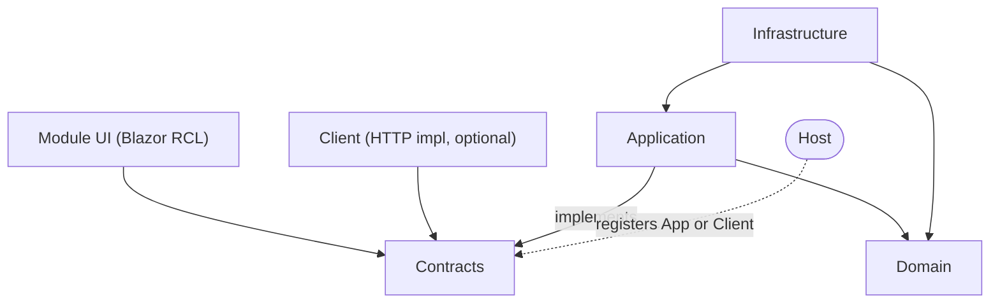

# Glossary

One agreed meaning per domain term. Reference these in every discussion; propose new entries as terms emerge.

## Module bundle layout

The layout in which each [Module](#module) lives under `src/Modules/<Name>/` as a bundle of layer projects: [Contracts](#contracts), [Domain](#domain), [Application](#application), [Infrastructure](#infrastructure), an optional [Client](#client), and [Module UI](#module-ui). The `add-module` and `module-deps` skills support it for repos that use it. It is not the default for new repos, which follow the `dotnet` profile's default conventions.
_Avoid_: legacy layout, Module architecture

## Module

Part of the [Module bundle layout](#module-bundle-layout). A vertical slice of a system under `src/Modules/<Name>/`, containing its own Clean Architecture layers: [Contracts](#contracts), [Domain](#domain), [Application](#application), [Infrastructure](#infrastructure), optional [Client](#client), and [Module UI](#module-ui). Modules communicate with each other **only** through Contracts.
_Avoid_: feature, component, slice, bounded context

```mermaid
graph TD
  UI["Module UI (Blazor RCL)"] --> C[Contracts]
  Client["Client (HTTP impl, optional)"] --> C
  App[Application] -->|implements| C
  App --> D[Domain]
  Infra[Infrastructure] --> App
  Infra --> D
  Host([Host]) -. registers App or Client .-> C
```

## Contracts

Part of the [Module bundle layout](#module-bundle-layout). A [Module](#module)'s pure public surface: interfaces, DTOs, and integration events. The only project other Modules and UIs may reference; it references nothing.
_Avoid_: public API, client interface

## Domain

Part of the [Module bundle layout](#module-bundle-layout). A [Module](#module)'s entities, value objects, and domain logic. References nothing.

## Application

Part of the [Module bundle layout](#module-bundle-layout). A [Module](#module)'s use-case layer and the **in-process** implementation of its [Contracts](#contracts). References Domain and Contracts.
_Avoid_: services layer, business logic layer

## Infrastructure

Part of the [Module bundle layout](#module-bundle-layout). Persistence and external-service implementations for a [Module](#module). References Application and Domain.

## Client

Part of the [Module bundle layout](#module-bundle-layout). An optional **HTTP** implementation of a [Module](#module)'s [Contracts](#contracts), used when the Module is deployed remotely. A [Host](#host) registers it in place of [Application](#application); consumers never know which is running.
_Avoid_: proxy, API wrapper, SDK

## Module UI

Part of the [Module bundle layout](#module-bundle-layout). A Blazor Razor class library presenting a [Module](#module)'s functionality. Depends only on [Contracts](#contracts), so the same UI runs in any [Host](#host) — web or WPF.
_Avoid_: front-end, component library

## Host

A runnable project under `src/Hosts/` (a web app, or a WPF app with BlazorWebView), and the only place an application is wired together: its composition root. A Host composes libraries by calling their registration entry points (`Add<Name>()` in .NET) and holds no behaviour of its own. In the [Module bundle layout](#module-bundle-layout), it registers each Module's [Application](#application) or [Client](#client).
_Avoid_: app shell, launcher

## Common types

A small, slow-changing project of types used across the codebase. It references no project that owns behaviour, so anything may depend on it. It is an ordinary referenced project, not a Visual Studio Shared Project (`.shproj`) or linked source.
_Avoid_: shared types, shared project, utilities

## Vertical Slice

The style of dividing a system by business capability rather than technical layer. In the [Module bundle layout](#module-bundle-layout), each slice is a [Module](#module).

## Cogniva

The brand name for this team's shared development tooling. The Claude Code plugin marketplace in this repo is named `cogniva` (hosted at github.com/cogniva/cogniva-skills); general-purpose tools ship in `cogniva-skills` (glossary, reference, project-requirement, project-context), development-specific tools in `cogniva-dev` (adr, backlog, repo-init, add-module, and the feature lifecycle). Tools are never named after individual team members.

## Plan

An implementation plan under `docs/plans/<Module>/<Feature>/`, produced by `plan-feature` and executed by `execute-feature`.

## Spec

A validated design document in `docs/specs/`, written before a [Plan](#plan).

## Backlog

Planned-deferral work tracked under `docs/plans/`: every new item carries a reason not to do it now in its `because:` tag. A direct human capture that supplies no specific reason is recorded as `because:human later`; skill-initiated deferrals require a concrete reason. Legacy entries without `because:` remain valid and may be flagged by grooming. Loose one-line items in a `BACKLOG.md` (repo-level, or per-[Module](#module)), or feature-sized [Backlog stubs](#backlog-stub). Captured with the `backlog` skill, whose capture bar routes reason-less work to be done now or planned instead; surfaced by `module-status` / `repo-status`.
_Avoid_: todo list, icebox, wishlist

## Backlog stub

A feature-sized deferred idea tracked as a folder `docs/plans/<Module>/<Idea>/` with a `state.md` ([Status](#status) `deferred`) and a `backlog.md`, but **no** `<Idea>-plan.md`. The missing plan is what marks it a stub; promoting it (via `plan-feature`) writes the plan and flips its [Status](#status) to `planned`.
_Avoid_: placeholder, draft plan

## Grooming

The evidence-backed review of the [Backlog](#backlog): a read-only scan proposes closures (already-done, obsolete, superseded, duplicate) each with a receipt, the user confirms once, and items are then closed with [Exit verbs](#exit-verb) or reworded in place. Performed by the `groom-backlog` skill; append-by-default, never deletes lines.
_Avoid_: cleanup, pruning, triage

## Exit verb

The `→` annotation that closes a [Backlog](#backlog) line or stub and records why: `planned:` / `done` when picked up, or the grooming verbs `obsolete:`, `superseded-by:`, `merged-into:`, `wont-do:`. Grammar defined in the backlog skill's `BACKLOG-FORMAT.md`.
_Avoid_: resolution marker, status tag

## Low-involvement work

A [Backlog](#backlog) item the `easy-work-scan` skill judges safe to hand off without the user in the loop: no pending design decision, unambiguous wording, mechanically verifiable, small blast radius, nothing irreversible — all five, or it is disqualified with the failing reason. Distinct from `size:S`, which measures effort, not autonomy.
_Avoid_: easy work, low-hanging fruit, quick win

## Ride-along

Work surfaced during planning or execution that is done as part of the current work rather than deferred to the [Backlog](#backlog) — presented as **Do now** in the route-first confirmation gate, and the assumed preference when the context is in hand (a named path), the goal is unchanged, the work is not plan-sized, and any open decision is small enough to pose in the gate table. Named for the merge it rides. Offered once per run and never recursive: a ride-along carries no ride-alongs of its own.
_Avoid_: fold-in, tag-along, scope creep

## Status

The lifecycle stage of a feature, recorded as the `Status:` line in its `state.md`: `deferred → planned → in-progress → blocked → integrated → done`. Seeded by `plan-feature`, advanced by `execute-feature`, and read by the status skills. A deferred stub can also exit the lifecycle via [Grooming](#grooming): `deferred → obsolete | superseded | wont-do`.
_Avoid_: state, stage

## Architecture profile

A named set of declarative architectural standards for one kind of codebase (e.g. `dotnet`): a folder holding a `profile.yml` and Markdown files under `standards/`. It may inherit one other profile. It adds new standards under `standards/`, changes inherited ones with [Amendments](#amendment), or, rarely, supersedes them with a [Replacement standard](#replacement-standard); a same-name file in `standards/` is an error. A profile is either a [Library profile](#library-profile) or a [Repo-owned profile](#repo-owned-profile), and tools read only the repo's copies. Selected per path by a [Profile marker](#profile-marker).
_Avoid_: stack, tech profile, template

## Profile marker

A `.cogniva-profile.yml` file containing `profile: <id>` (or `profile: none`) that selects the [Architecture profile](#architecture-profile) for its folder and everything below it. The marker nearest a path wins; the one at the repo root is the repository default. Written only by a human decision, never inferred.
_Avoid_: profile config, profile declaration

## Amendment

A file at `amendments/<id>.md` in an [Architecture profile](#architecture-profile) that adds to a standard the profile inherits. Amendments stack on the inherited text from the root profile down; they can add or narrow, never delete, and the standard keeps receiving updates from its parent. When the parent's text changes, the amendment is flagged for human review instead of being dropped.
_Avoid_: override, patch

## Replacement standard

A file at `replacements/<id>.md` that supersedes an inherited standard outright, along with every amendment above it. It stops receiving updates from its parent, and every resolver output says so. Rare by design; prefer an [Amendment](#amendment).
_Avoid_: override, fork

## Library profile

An [Architecture profile](#architecture-profile) shipped by the cogniva-dev plugin (`cogniva-base`, `dotnet`). A repo holds an adopted copy under `.cogniva/profiles/`; only the adopt script writes that copy, and a local edit blocks refresh. Changes specific to one repo belong in a [Repo-owned profile](#repo-owned-profile).
_Avoid_: managed profile, built-in profile

## Repo-owned profile

An [Architecture profile](#architecture-profile) a repository writes for itself under `.cogniva/profiles/`. It usually inherits a [Library profile](#library-profile) and adds the repo's own standards, amendments and exceptions. Adopt and refresh never touch it.
_Avoid_: child profile, custom profile
