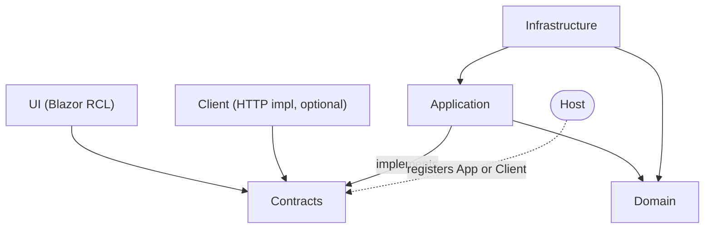

# Design: `repo-foundry` — reusable repo setup toolkit

- **Date:** 2026-06-11
- **Status:** Approved
- **HTML version:** [2026-06-11-repo-foundry-design.html](2026-06-11-repo-foundry-design.html)

## Purpose

A self-contained toolkit repo that packages everything needed to initialize and grow new repos: architecture scaffolding, glossary seeding, and plan/spec presentation tooling. Distributed as a Claude Code plugin so improvements propagate to every consuming repo.

## Repo layout

This repo is a **local Claude Code plugin marketplace** holding one plugin (`repo-foundry`) plus its own docs.

```
NewRepo/
  .claude-plugin/marketplace.json
  plugins/repo-foundry/
    .claude-plugin/plugin.json
    skills/
      repo-init/SKILL.md        # scaffold a brand-new repo
      add-module/SKILL.md       # add a Module to an existing repo
      plan-to-html/SKILL.md     # convert a plan/spec md -> HTML
    hooks/hooks.json            # auto-trigger plan-to-html
    scripts/convert-plan.ps1    # the md -> HTML converter
    templates/                  # glossary seed, CLAUDE.md, module layout, HTML/CSS
  docs/
    strategy.md                 # conventions + tooling decisions
    glossary/README.md          # canonical glossary (source for the plugin's glossary template)
```

## Architecture conventions

Defined in the [glossary](../../glossary/README.md) and baked into templates and the generated repo CLAUDE.md:

- Vertical slices are called **Modules**: `src/Modules/<Name>/`
- **Hosts** (`src/Hosts/Web`, `src/Hosts/Wpf`) are composition roots — each registers either the in-process Application or the HTTP Client implementation of a Module's Contracts
- UIs are always **Blazor**; a Module UI depends only on Contracts so the same UI runs in a WPF host (BlazorWebView) or a web host
- Tests mirror modules under `tests/`

| Project | Role | May reference |
|---|---|---|
| `<Name>.Contracts` | Pure public surface: interfaces, DTOs, integration events. The *only* thing other Modules and UIs reference. | nothing |
| `<Name>.Domain` | Entities, value objects, domain logic | nothing |
| `<Name>.Application` | Use cases; in-process implementation of Contracts | Domain, Contracts |
| `<Name>.Infrastructure` | Persistence, external services | Application, Domain |
| `<Name>.Client` *(optional)* | HTTP implementation of Contracts for remote deployments | Contracts |
| `<Name>.UI` | Blazor Razor class library | Contracts only |
| Hosts | Composition roots; pick Application or Client per deployment | everything |



## The three skills

| Skill | What it does |
|---|---|
| `repo-init` | Interactive scaffold: git init, solution + `src/Modules` / `src/Hosts` / `tests` layout, glossary seed, repo CLAUDE.md with the dependency rules, `.gitignore` / `.editorconfig`, first commit. |
| `add-module` | Scaffolds one Module's projects (Client offered but skippable), wires them into the solution, adds a glossary entry for the new Module. |
| `plan-to-html` | Converts a markdown plan/spec into a **single self-contained HTML file** (CSS + vendored marked.js / mermaid.js inlined — no network, portable). Clean typographic layout, rendered Mermaid, h2 sections rendered collapsible (expanded by default), and **auto-linked glossary terms** (first whole-word occurrence per section, case-insensitive, links to the glossary entry). |

## Plan-to-HTML automation

- `PostToolUse` hook on Write/Edit; script checks the path against `docs/plans/**/*.md` and `docs/superpowers/specs/**/*.md`
- On match: `convert-plan.ps1` regenerates the sibling `.html` (idempotent, overwrites)
- Hook feeds context back so Claude reports "HTML ready" and offers to open it — always ending the message with the raw `file:///` URL
- Conversion failure never blocks the write — it warns and moves on

## Testing & verification

- **Converter:** sample plan fixture (headings, tables, Mermaid, code blocks, glossary terms) + Pester test asserting valid self-contained output
- **Skills:** verified per the writing-skills checklist; hook tested by writing a dummy plan and confirming HTML appears
- **repo-init / add-module:** dry-run against a temp directory before first real use

## Non-goals (for now)

- Remote marketplace / distribution — local path install only
- Enforcing dependency rules via Roslyn analyzers or ArchUnitNET — CLAUDE.md rules first; analyzers are a roadmap note in `strategy.md`
- NuGet packaging of module templates

## Decision log

| Decision | Choice | Rejected alternatives |
|---|---|---|
| Name for vertical slices | **Module** (modular-monolith idiom) | Feature (implies per-use-case granularity), BoundedContext (verbose, DbContext collision), Slice (non-standard) |
| Public surface name | **Contracts**, with **Client** as separate optional HTTP implementation | Single "Client" project (tangles contracts with transport; UI would carry HTTP deps it never uses) |
| Tooling packaging | **Claude Code plugin** in local marketplace | Template-copy (drifts), user-global skills (invisible to team, not version-controlled) |
| HTML automation scope | **All plans + specs** via hook | Plans-only; manual-only skill |
